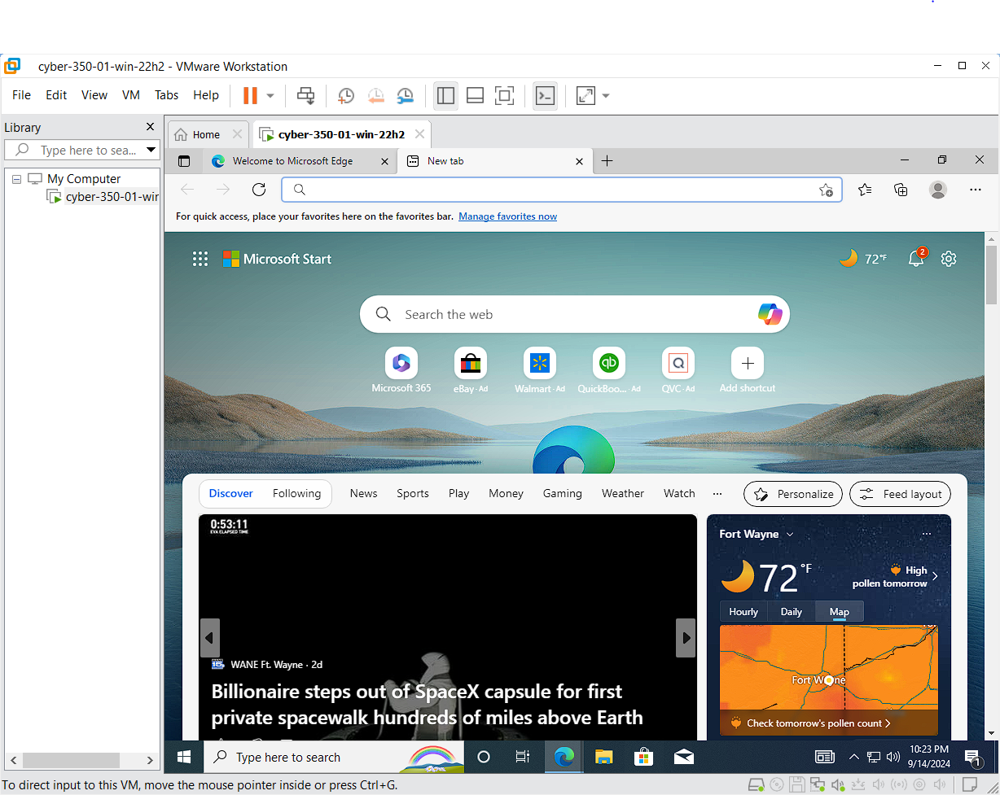

# Download Windows 10 EDU 22H2

[Microsoft Education Site](https://portal.azure.com/?Microsoft_Azure_Education_correlationId=5f1675b0-3fd5-40d7-920f-7a2ab295d02d#view/Microsoft_Azure_Education/EducationMenuBlade/~/software)

- OS: Windows 10 22H2
- Key: 2CBTB-66NWD-W643C-VG6DF-HQWWB

## Create VM
If you've installed a VM in VMWare before, these steps are review. VMWaqre makes
it pretty easy and the installation is almost identical to what you experience
on physical hardware.

``` text
01. Create VM
02. Custom
03. VMW 17 Compatible
04. Choose Installer Disk Image
    a. Browse
    b. en-us_windows_10...iso
    c. open
    d. next
    e. paste product key
    f. add a username
    g. add a password
    h. next
    i. machine name: cyber-350-01-win-22h2
    j. firmware: uefi
    k. 2 procs
    l. 4096 mb memory
    m. bridged
    n. lsi logic sas
    o. next
    p. nvme
    q. create virtual disk
    r. 100 GB
    s. disk file keep it
    t. D:\vms\cyber350_01\cyber-350-01-win-22h2.vmdk
    u. save
    v. next
    w. finish
```

## Install Windows
Most of the install is automatic. I install an AV tool and notepad++ on any 
machine that I configure.

``` text
01. Installer
    a. power on vm
    b. windows setup starts
    c. most of these steps are few and simple
    d. allow network discovery
    e. yes
    f. install total av or some other type of anti virus
    g. install notepad++
    h. take a screenshot and post to week1 assignment
```

## Collect Screenshot of Completed VM

